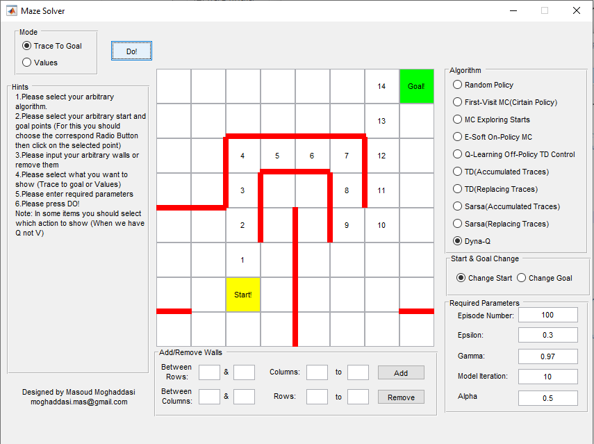

# Maze Solver GUI

In this GUI several RL methods for solving a maze are provided. This GUI is provides the user with the possiblity of changing
the parameters and maze itself and can be used for teaching purposes.
For runing please use HW1.m
#

User Interface of the Maze Solver GUI.
#
## History:
  2015  The first official version of the GUI by Masoud Moghaddasi
  Copyright (C) 2015 Masoud Moghaddasi
  This software is distributed under the GNU General Public Licence V2

## Refference:
  [1] Sutton, R.S., 1998. Sutton & Barto Book: Reinforcement Learning: An Introduction. In A Bradford Book. Cambridge, MA: MIT Press.
